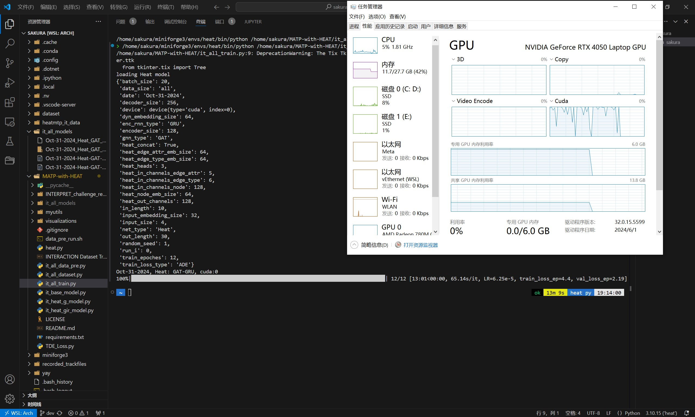

# 配置说明
20241030
## 前言
requirements的版本太老了，wheel编译会失败，换用最新的版本就行。python==3.10.15

现在我们有几个文件夹在主目录~下并列，后者是git clone我fork后的版本得到的
```
├── dataset
├── MATP-with-HEAT
│   ├── INTERPRET_challenge_regular_generalizability_track
│   ├── ...
```
**以下都以dataset/Multi-v1为示例，其他同理**
## 预处理
**INTERPRET_challenge_regular_generalizability_track** 目标：重新按frame_id排序得到sorted文件夹

0. case_id处理说明

    本次处理中case_id是不规范的列，综合考虑如下因素：

    - INTERPRET_challenge_regular_generalizability_track代码中不允许包含case_id列
    - MATP-with-HEAT并没有提及case_id列
    - MATP-with-HEAT数据载入中的所有samples，是指所有scenario_names(如DR_CHN_Merging_ZS2)文件夹下的所有csv，详见IT_ALL_MTP_dataset函数定义
    
    因此决定，将每个csv按照case_id拆分成若干个csv

1. 重构文件夹

    在`myutils/data_rebuilt_folder.sh`开头填写要运行的数据集地址DATASET_DIR，然后运行

    ```cmd
    sh data_rebuilt_folder.sh
    ```

    输出符合input样式的`recorded_trackfiles`，不动这个位置

2. case_id处理

    在`myutils/config.py`填写你要处理的某个数据集DIR地址，然后运行
    ```cmd
    python -u "myutils/split_case.py"
    ```
    如果要运行单个scenario或者全部scenario，改动`split_case.py`变量`target_case_name`

    输出拆分case后的文件的文件在`~/recorded_trackfiles`
3. sorted

    ```cmd
    python -u "myutils/segment_data.py"
    ```

    采用default指令的默认设置为block_len=40，gap_len=20，argv_len=0

    输出sorted在`~/recorded_trackfiles`对应scenario下
    
## 主程序
**MATP-with-HEAT**

现在的tree如下
```
├── dataset
├── MATP-with-HEAT
│   ├── INTERPRET_challenge_regular_generalizability_track
│   ├── visualizations
│       ├── map_png
│       └── ...
├── recorded_trackfiles
│   ├── DR_CHN_Merging_ZS0
│   │   ├── train
│   │   │   └── sorted
│   │   └── val
│   │       └── sorted
│   ├── ...

```
0. map对应

    在后续处理中，发现map的不对应导致的报错

    建议依照`MATP-with-HEAT/visualizations/map_png`更改`dataset/Multi-v1/`csv的名字，或者复制多一份png地图以相互呼应

    例如，ATP-with-HEAT没有ZS0和ZS1的png，但有ZS。经过比对,dataset的ZS0和ZS1与MATP-with-HEAT/visualizations/map的ZS一模一样，因此多复制一个ZS0png

1. 运行我更改后的data_pre_run.sh，它会自动读取上面$HOME/recorded_trackfiles/下的所有scenario进行处理，添加了tqdm进度条，开启多线程`num_pros = 8 if True else 1`也耗时非常长，至少几个小时

    输出处理后的文件在`~/heatmtp_it_data`下，包含MAP.pt和每个csv转换后的pyg

    >   如果AgTkk画图报错`ImportError: libX11.so.6: cannot open shared object file: No such file or directory`，可以在conda环境安装tkagg

    说明：

    源代码`np.unique(self.cur_track['frame_id'])[10:-self.fut_len]`的[10:-30]提取会让返回空列表,使得无法生成pyg，何意呢？

2. 我们来对齐一下现在进度
    
    现在的文件结构是：

    ```
    ├── dataset
    ├── recorded_trackfiles
    ├── heatmtp_it_data
    │   ├── DR_CHN_Merging_ZS0
    │   │   ├── train
    │   │   │   └── tracks_3501_f1.pyg
    │   │   └── val
    │   │   │   └── tracks_3502_f1.pyg
    │   │   └── MAP.pt
    │   └── ...
    ├── MATP-with-HEAT
    │   ├── INTERPRET_challenge_regular_generalizability_track
    │   ├── visualizations
    │   ├── it_all_data_pre.py
    │   ├── it_all_dataset.py
    │   ├── ...
    ```
    直接运行`it_all_dataset.py`，应该得到的输出样例如下
    ```text
    there are 891 data in this dataset
    tensor([False,  True,  True,  True,  True,  True,  True,  True,  True,  True,
    True,  True,  True,  True,  True,  True])
    tensor([False,  True,  True,  True,  True,  True,  True,  True,  True,  True,
            True,  True,  True,  True,  True,  True, False,  True,  True,  True,
            True,  True,  True,  True,  True,  True,  True,  True,  True,  True,
            True,  True,  True,  True,  True])
    ```
3. 运行`python it_all_train.py -m Heat`，数据成功载入

    剩下的就是model的维数对齐问题了

    > RuntimeError: input.size(-1) must be equal to input_size. Expected 64, got 128
    >
    >    同步改args['encoder_size']和args['heat_in_channels_node']=128

    在`./it_all_models`输出log和模型

    下面是成功训练的示例，这里只用了一小部分数据做测试

    


---

# MATP-with-HEAT
This repo contains the code for our paper entitled "Multi-Agent Trajectory Prediction with Heterogeneous Edge-Enhanced Graph Attention Network", IEEE T-ITS, 2022.

## Install dependencies via pip.
`pip install -r requirements.txt`

## Data preprocessing
The strucutre of the raw INTERACTION Dataset can be found in `INTERACTION Dataset Tree.txt`.

To obtain the sorted dataset, please refer to 
[INTERPRET_challenge_regular_generalizability_track](https://github.com/interaction-dataset/INTERPRET_challenge_regular_generalizability_track). 

Run `bash datapre_run.sh` to process all the scenarios provided by the INTERACTION dataset.

## Models
Base model -> Heat model -> HeatIR model.

## Traning
Run `python it_all_train.py -m Heat` to train the one-channel HEAT-based trajectory predictor.

## Validation

## Citation
If you have found this work to be useful, please consider citing our paper:
```
@article{mo2022multi,
  title={Multi-agent trajectory prediction with heterogeneous edge-enhanced graph attention network},
  author={Mo, Xiaoyu and Huang, Zhiyu and Xing, Yang and Lv, Chen},
  journal={IEEE Transactions on Intelligent Transportation Systems},
  year={2022},
  publisher={IEEE}
}
```
